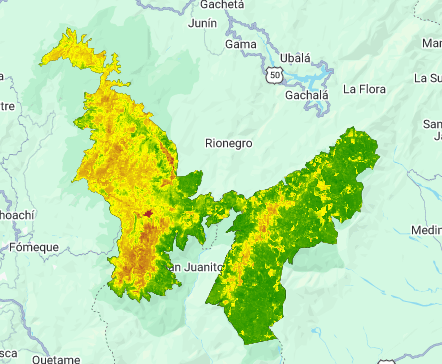

# MINI-PROYECTO_INCENDIOS_GEE
Este proyecto tiene objetivo el desarrollo de un algoritmo para la deteccion y mapeo de areas quemadas, utilizando imagenes Satelitales Opticas de Sentinel-2 y la plataforma Google Earth Engine (GEE).

---
## Metodologia
**Fecha:** 04/02/2026

**Objetivo:** Desarrollar un algoritmo para la deteccion y mapeo de areas quemadas utilizando imagenes satelitales de sentinel-2.

**Objetivos especificos**
implementar el indice Normalizado de Area Quemada para resaltar areas quemadas en zonas de incendio, asi como su nivel de severidad

Incorporar Random Forest coo modelo de aprendizaje automatico, permitiendo autoajustar los eventos definidos como areas quemadas

analizar  la resolucion de sentinel-2 para la identificacion de incendios de escala local en ecosistemas complejos como los paramos y bosques andinos

**Conceptos:** NIR, SWIR, NBR, dNBR, Resolucion espectral

**Decisiones Tecnicas:** se prioriza el uso de dNBR respecto a NBR, ya que permite camptar cambios temporales en las respectivas areas asociadas a incendios

**Implementacion:**

1. Implementamos el dasets de Sentinel-2 en el GEE code
2. se hace uso de la mascara QA60, la cual sirve para decir que pixeles son confiables
3. apuntamos los bits especificos para observar pixeles sin nubes, usando los bits 10 y 11 (nivel low 0)
4. se incluye la coleccion de imagenes de copernicus, usando Surface Reflectance (SR)

  [Codigo Datasets](../scripts/data_preparation/datasets.js)
Fuente: https://developers.google.com/earth-engine/datasets/catalog/COPERNICUS_S2_SR_HARMONIZED

 **Fecha:** 05/02/2026

5. Definimos nuestro ROI (Region of interest), Parque Nacional Natural de Chingaza
lo realizamos por medio de la base de datos de wpda, la cual se encuentra registrado el grupo de vectores de loas reservas naturales mundiales, a demas como se menciono fue definido a partir de FeatureCollection, y se convirtio a una geometria mediante el metodo ee.geometry(), con el fin de utilizar una delimitacion limpia. del mismo modo se recorta la imagen por medio de clip ()
[Chingaza](../scripts/Incendio_Chingaza/Chingaza_WDPA.js)

 

6. ubicamos una fecha, en la que hubieran habido incendios en PNN Chingaza y ubicamos una fecha de Pre-Incendio y Post-Incendio, para asi poder compararlos y realizar el respectivo analisis.

Por esto segun en Ministerio de ambiente  seleciono como fecha central el 15 de enero del 2025 en el cual cerca de 147 Hectares fueron afectada por incendio. 

https://www.minambiente.gov.co/cerca-de-147-hectareas-afectadas-por-incendio-forestal-en-el-parque-nacional-natural-chingaza/

por lo cual usamos el rango de pre incendio desde el 15/12/2024 hasta el 13/01/2025, y el rango post incendio usamos del 24/01/2025 hasta el 17/02/2025
[Pre-Post](../scripts/Incendio_Chingaza/Pre_post.js)

**Resultados Preliminares:** la comparacion RGB entre el pre/post incendio permite visualizar distintos parches oscuros compatibles con cicatrices de incendio. sin embargo debido a la baja sensibilidad del RGB no nos permite observar cambios estructurales acerca de la vegetacion y su respectivo estado, por lo cual se procede al analisis en NIR y SWIR

**Fecha:** 06/02/2026

7. se implementa las variables de NIR (NIR Alto cuando hay vegetacion sana) y SWIR (SWIR Alto cuando ceniza/suelo seco) tanto pre incendio como post incendio, con este valor pasamos a la medicion de la Tasa de Quemada Normalizada (NBR), ademas de su severidad de incendendio, hallando la diferencia entre NBR posterior y el NBR previo, hallando asi su indice de severidad de incendios, estos  umbrales son proporcionados por USGS, que son representado en el codigo

[dNBR](../scripts/Analisis/dNBR.js)

**Resultados Preliminares**
se observa principalmente un amarillo extendido de gran cantidad en toda la parte occidental, con severidad baja 0,27 corresponden principalmente a variacione fenologicas y cambios en el contenido hidrico de la vegetacion, en cambio se identifica el incendio con un rojo intenso, como se observable en el area cerca a la laguna de chingaza, si se observa la informacion presentada por Parques Nacionales Naturales de Colombia, acerca de la localizacion del incendio forestal (14/01/2025), se analiza que el punto registrado por GEE, existe coincidencia espacial respaldando la validez del enfoque propuesto

Parques Nacionales Naturales de Colombia (2025). localizacion incendio forestal (14/01/2025) [Imagen] https://www.bluradio.com/regiones/cundinamarca/incendio-en-chingaza-pudo-haber-sido-provocado-inicia-investigacion-mientras-buscan-apagarlo-pr30 

con esta validacion se verifica que el mapeo del area quemada quedo de manera adecuada

**Dificultades:** fue fundamental utilizar una Funcion de limpieza radiometrica, utilizando parametros compatibles con paramo / bosque alto-andino, mejorando de gran manera, la calidad del analisis 

**Proximo paso:** identificar cuantas Hectareas  fueron afectadas en el punto georeferenciado

8. se implementan un local point en el punto donde se identifico el respectivo incendio, con esto medir poder medir cuantas hectareas corresponden al incendio, observamos

[text](../scripts/Analisis/Punto_Local.js)

**Resultados Preliminares**
obtenemos  los siguientes resultados:

Área quemada ZONA LOCAL (ha):
106.27384413172109

Área local severidad baja (ha)
6.122367581116919

Área local severidad moderada (ha)
28.25677023651721

Área local severidad alta (ha)
71.89470631408692

como se observa segun la informacion entreda por el ministerio de ambiente el valor de las hectareas es aproximada pero no 100% eficaz.

**Dificultades:** esto se podria presentar por varios motivos, uno de estos es que en el PNN Chingaza,   tiene un relieve abrupto, humedad residual, niebla etc, permitiendo que algunos pixeles queden enmascarados, de la misma forma estamos utilizando un umbral dNBR conservador, 0,27, excluyendo vegetacion estresada, zonas de quema superficiel, pero tambie podriamos detectar falsos positivos, y por ultimo el reporte presentado por el ministerio corresponde a reportes operativos, como brigada o sobrevuelos, presentando persepciones visuales, contando sectores con humo intenso, vegetacion chamuscada, impacto termico indirecto, por lo cual puede ser una de las razones, ya que sentinel mide la alteracion radiometrica consistente

**Proximo paso** introducir Random Forest, para reducir falsos positivos, integrar multiples bandas e indices, Comparar dDBR vs aprendizaje automatico (ML)

**Fecha:** 07/02/2026

9. Implementar Random Forest, RF es un algoritm de aprendizaje automatico supervisado, que se basa en conjuntos, conformado por N arboles de decision, y cada de estos arboles se entrena con muestras o un subconjunto aleatorio de varibales

como se observo anteriormente el dNBR puede confundir un incendio con  estres hidrico, Fenologia natural, cambio de humedad del suelo, señalando asi falsos positivos,  por esto RF se usa para comprobar que el fenomeno si es un incendio, lo hace por medio de la extraccion de las firmas espectrales multibandas, en este caso RGB, NIR, SWIR y con esto el respectivo bNBR, con esto se entrena el RF para aprender la firma espectral real del incendio, seleccionando solo pixeles que cuentas con un alto dNBR, bajo NIR y un alto SWIR, eliminando estos falsos positivos

por esto se desarrolla un algoritmo, en donde se implementa un RFSTack, que es un vecto de caracteristicas, las cuales permite al AA, decidir si la zona esta quemada o no, y se añade la medicion dNBR como otra variable de la cual parte RF aprendiendo a corregirlo, ademas es importante aclarar que se usa la imagen post que es en la que se logra evidenciar el incendio, pero esto se plantea los umbrales cuando hay incendio y cuando no, se tomas 600 datos que son balanceados entre ambos estados, y se reduce ruido.

se procede a la creacion de RF, se le asignan 300 arboles independientes, en donde cada hoja debe tener al menos 5 muestras y cada arbol se entrena con el 70% de  las muestras, este proceso tambien conocido como bagging ya que cada muestra se puede tomar mas de una vez pero de manera paralela para tomar decisiones de clasificacion, quiere decir que genera una votacion mayoritaria, en otras palabras toma su vector espectral, lo pasa por cada arbol, este realiza la respectiva votacion (quemado o no quemado), y devuelve la probabilidad final con valores entre 0 a 1, pero como los valores son balanceados debemos poner un clasificador para que identifique que fenomeno es, generando asi un umbral probabilistico

se realiza del mismo modo una comparativa entre el planteamiento anterior y el modelo de aprendizaje automatico, en donde usamos la diferencia entre probabilidades utilizandolo con indicador de discrepancia espacial, con esto se puede hacer una matriz de confusion en donde RF detecto incendio correcto, RF descarto correctamente, falsas alarmas RF, incendios que RF no detecto, con este mismo principio se deduce el porcentaje de pixeles que coinciden entre RF y dNBR, y por ultimo medidos el Kappa, que mide cuantos pixeles coinciden porque realmente hay informacion

**Resultados Preliminares**
.png>)

se observa que el unico lugar en donde expresa un verdadero incendio es en la ubicacion presentada en el Parques Nacionales Naturales de colombia, mientras que todo el parametro de baja intensidad presentado por el indice dNBR, ha desaparecido estableciendo que no eran areas de incendio, si no zonas de estres hidrico, o como se menciono fenologia Natural, presentando una gran mejora en el analisis y autoajuste de datos

del mismo modo los datos presentados en la consola fueron los siguientes:

Matriz de confusión RF vs dNBR
[[3695,75],[0,117]]

3695 pixeles acuerdo No-quemado, 75 RF detecto incendio donde dNBR no lo indicaba, 0 RF no detecto ningun incendio, y 117 incendios detectados correctamente

Exactitud global
0.9807049138152817

98% de los pixeles evaluado por Random Forest fueron clasificados de la misma manera con el indice dNBR

Kappa
0.747849553044358

corresponde a una concordancia sustancial, quiere decir que si captura de forma consistente el patron de incendio pero no es perfecto

**Dificultades**
la diferencia entre kappa y la exactitud global presenta limitaciones reales del modelo frente a la complejidad espectral del terreno 

## Conclusiones 
el indice NBR permite una deteccion rapida y efectiva de areas potencialmente quemadas, sin embargo es sensible a variabilidades fenologica y cambios de humedad

la incorporacion de Random Forest, permitio mejorar la especificidad de mapeo, reduciendo falsos positivos sin perder la coherencia de ls reportes oficiales

sentinel-2 brinda una resolucion y un sistema multibanda adecuada para incendios de escala local en ecosistemas complejos como el PNN Chingaza

la respectiva combinacion entre el indice y el modelo de aprendizaje autonomo resulta robusto y eficaz para aplicaciones operativa y de investigacion

## Trabajo Futuro
como extension del presente trabajo, se propone comparar los resultados del sensor MODIS MCD64A1, que es orientado en la deteccion de areas quemadas, evaluando las diferencias asociadas a resolucion espacial y temporal para la teledeteccion en este tipo de fenomenos.

Adicionalmente, la incorporacion de variables topograficas permitiendo analizar la influencia del relieve en la propagacion y severidad del incendio.

Asimismo, se plantea de migrar el entrenamiento del modelo a entornos externos como Vertex AI, con el fin de evaluar escalabilidad, ajuste de hiperparametros, entre otros.

finalmente la implementacion de flujos python y QGIS permitiendo automatizar el calculo de indices espectrales y facilitar el analisis biofisico adicionales, como el estudio de vegetacion sana mediante NDVI 

